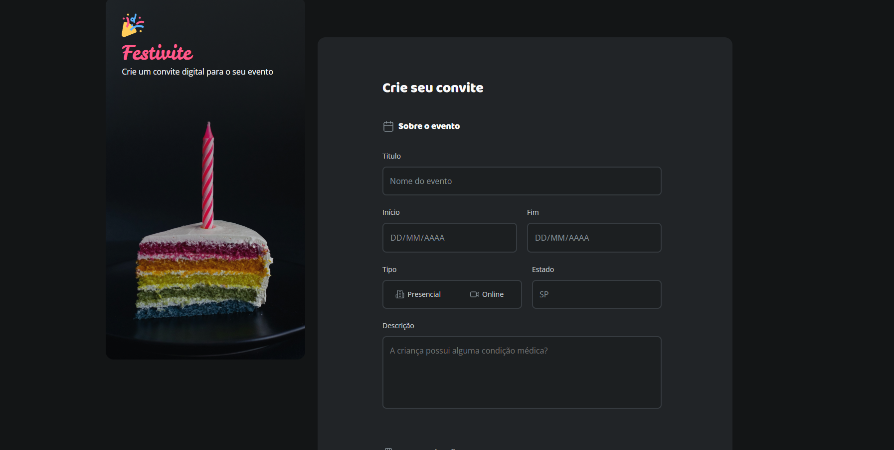

# Festivite - Formulário de Convite

Um formulário web para criação de convites digitais personalizados para eventos.

## 📋 Sobre o Projeto

O Festivite é uma aplicação web que permite aos usuários criar convites digitais personalizados para diversos tipos de eventos. Com uma interface intuitiva e opções de personalização, é possível criar convites únicos para qualquer ocasião.

## ✨ Funcionalidades

- **Informações do Evento**: Título, datas de início e fim, tipo (presencial/online), localização
- **Personalização Visual**: Seleção de cores principais e temas específicos
- **Temas Disponíveis**: 
  - Aniversário
  - Infantil
  - Formatura
  - Casamento
  - Chá de bebê
  - Chá de panela
  - Carnaval
  - Páscoa
  - São João
  - Halloween
  - Natal
- **Interface Responsiva**: Design adaptável para diferentes dispositivos

## 🚀 Como Usar

1. Clone o repositório:
```bash
git clone [url-do-repositorio]
```

2. Navegue até o diretório do projeto:
```bash
cd Formulario-de-Convite
```

3. Abra o arquivo `index.html` em seu navegador

## 📁 Estrutura do Projeto

```
Formulario-de-Convite/
├── assets/
│   ├── icons/          # Ícones e imagens dos temas
│   └── Background.png  # Imagem de fundo
├── styles/
│   ├── fields/         # Estilos específicos para campos
│   ├── forms.css       # Estilos dos formulários
│   ├── global.css      # Estilos globais
│   ├── index.css       # Estilos principais
│   └── layout.css      # Layout da página
└── index.html          # Página principal
```

## 🎨 Tecnologias Utilizadas

- HTML5
- CSS3
- Google Fonts (Archivo, Asap, Baloo 2, Inconsolata, Leckerli One, Maven Pro, Open Sans, Poppins, Roboto)

## 🤝 Contribuição

Contribuições são bem-vindas! Sinta-se à vontade para abrir issues ou enviar pull requests.